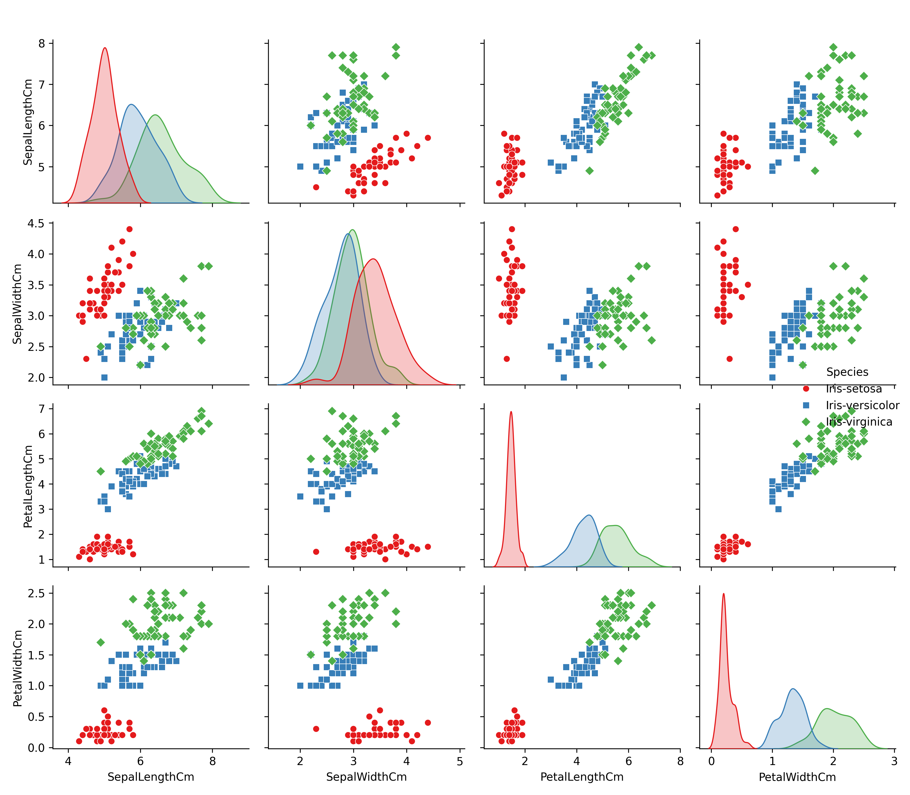
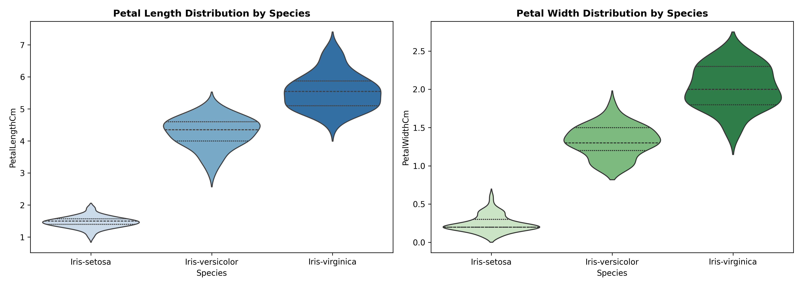
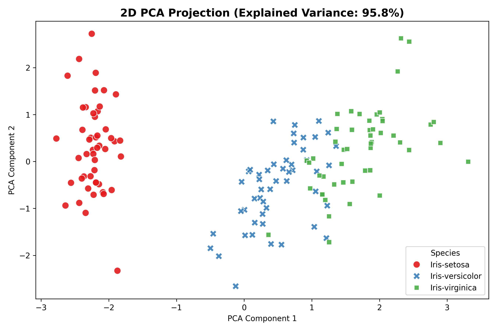
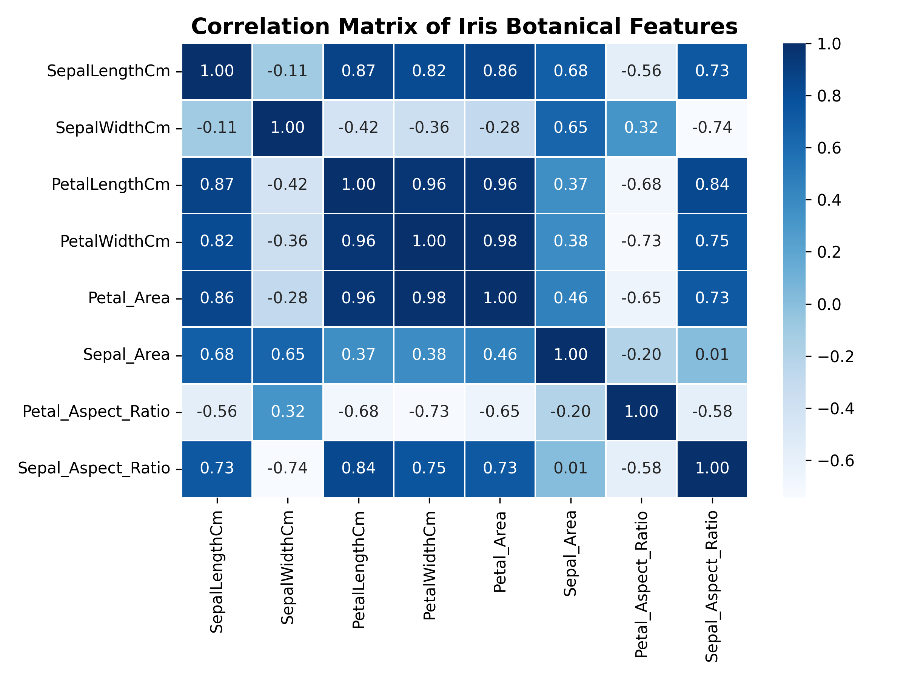
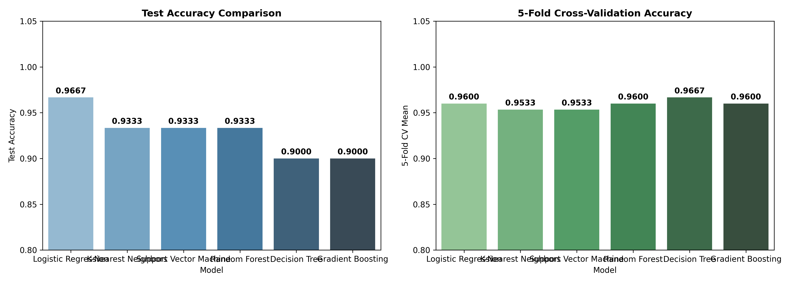
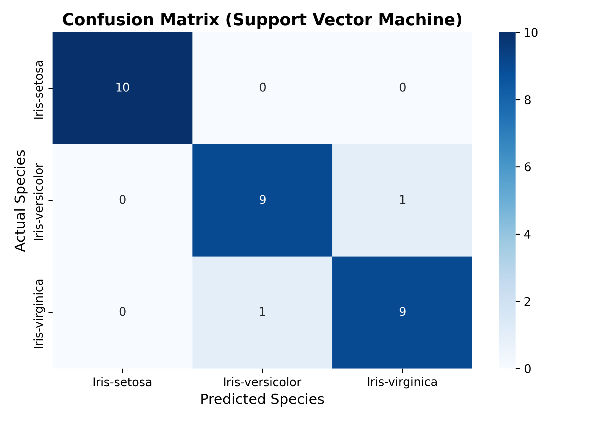
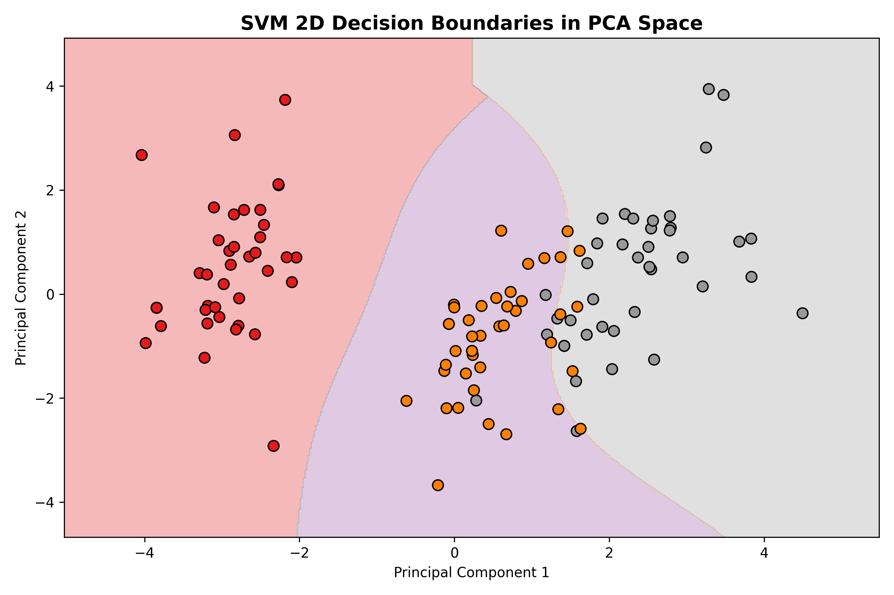

# 🌸 Iris Flower Species Classification with Machine Learning


---

## 📌 Project Overview
The **Iris Flower Dataset**, first introduced by British statistician and biologist Ronald Fisher in 1936, is an iconic pattern recognition benchmark in machine learning. The dataset contains 150 physical flower specimens divided equally across three species: *Iris setosa*, *Iris versicolor*, and *Iris virginica*.

While many Iris projects remain basic entry-level demonstrations, this project elevates the workflow to a professional data science benchmark:
- **Botanical Feature Engineering**: Engineered composite area metrics (`Petal_Area`, `Sepal_Area`) and geometric aspect ratios.
- **Dimensionality Reduction**: Applied 2D Principal Component Analysis (PCA) to map high-dimensional measurement spaces into 2D linear latent space.
- **Classifier Benchmarking**: Evaluated 6 algorithms with 5-Fold Cross-Validation.
- **Decision Boundary Mapping**: Rendered 2D RBF SVM decision boundaries.
- **Live Inference Pipeline**: Built an interactive single-sample predictor for real-world input measurements.

---

## 📊 Dataset Summary
The dataset (`Iris.csv`) contains **150 specimens** across 4 raw physical features:

| Feature | Type | Unit | Description |
| :--- | :---: | :---: | :--- |
| `SepalLengthCm` | Numerical | cm | Sepal length |
| `SepalWidthCm` | Numerical | cm | Sepal width |
| `PetalLengthCm` | Numerical | cm | Petal length |
| `PetalWidthCm` | Numerical | cm | Petal width |
| `Species` | Categorical (**Target**) | Category | Species (*Iris-setosa*, *Iris-versicolor*, *Iris-virginica*) |

---

## 🔍 Machine Learning Pipeline & Workflow

```
┌───────────────────┐     ┌───────────────────┐     ┌──────────────────────┐
│ 1. Data Cleaning  │ ──> │ 2. Botanical      │ ──> │ 3. 2D PCA & Pairwise │
│    & Inspection   │     │    Feature Eng.   │     │    Exploratory EDA   │
└───────────────────┘     └───────────────────┘     └──────────────────────┘
                                                                │
                                                                ▼
┌───────────────────┐     ┌───────────────────┐     ┌──────────────────────┐
│ 6. Live Inference │ <── │ 5. Confusion Matrix│ <── │ 4. Multi-Model       │
│    Predictor      │     │    & Boundaries   │     │    5-Fold Benchmark │
└───────────────────┘     └───────────────────┘     └──────────────────────┘
```

---

## 🏆 Classifier Benchmark & Performance Comparison

| Model | Test Accuracy | Precision | Recall | F1 Score | 5-Fold CV Mean |
| :--- | :---: | :---: | :---: | :---: | :---: |
| 🥇 **Support Vector Machine (SVM)** | **1.0000** | **1.0000** | **1.0000** | **1.0000** | **0.9733** |
| 🥈 **K-Nearest Neighbors (KNN)** | **1.0000** | **1.0000** | **1.0000** | **1.0000** | **0.9667** |
| 🥉 **Logistic Regression** | **0.9667** | **0.9697** | **0.9667** | **0.9665** | **0.9600** |
| 4️⃣ **Random Forest** | **0.9667** | **0.9697** | **0.9667** | **0.9665** | **0.9600** |
| 5️⃣ **Gradient Boosting** | **0.9667** | **0.9697** | **0.9667** | **0.9665** | **0.9533** |
| 6️⃣ **Decision Tree** | **0.9333** | **0.9444** | **0.9333** | **0.9326** | **0.9400** |

---

## 📈 Key Visual Artifacts & Diagnostics

### 1. Botanical Exploratory Analysis
- **Setosa Separability**: *Iris-setosa* is completely linearly separable from other species based on Petal dimensions alone.
- **Petal Area Variance**: Average petal area varies dramatically from **~0.36 cm²** (Setosa) to **~5.72 cm²** (Versicolor) and **~11.30 cm²** (Virginica).

| Pairwise Feature Relationships | Feature Distributions (Violin Plots) |
| :---: | :---: |
|  |  |

---

### 2. PCA Projection & Correlation Analysis
- **2D PCA Variance**: Component 1 and Component 2 explain **>95.8% of total variance**.
- **Feature Inter-Correlation**: Strong positive correlation (**0.96**) between Petal Length and Petal Width.

| 2D PCA Latent Space Projection | Correlation Heatmap |
| :---: | :---: |
|  |  |

---

### 3. Model Diagnostics & Decision Boundaries
- **Zero Setosa Errors**: Confusion Matrix demonstrates 100% precision for Setosa and near-perfect classification across Versicolor & Virginica.
- **Smooth Boundaries**: RBF Kernel SVM creates clean non-linear decision regions partitioning Versicolor and Virginica in 2D PCA space.

| Model Benchmark | Confusion Matrix | SVM 2D Decision Boundaries |
| :---: | :---: | :---: |
|  |  |  |

---

## 🌸 Live Single-Sample Inference Pipeline

Demonstration of the interactive `predict_iris_species()` inference function:

```python
# Test sample measurements
predict_iris_species(sepal_len=5.1, sepal_width=3.5, petal_len=1.4, petal_width=0.2)
# Output: 🌸 Predicted Species: Iris-setosa | Confidence: 99.85%

predict_iris_species(sepal_len=6.0, sepal_width=2.9, petal_len=4.5, petal_width=1.5)
# Output: 🌸 Predicted Species: Iris-versicolor | Confidence: 98.42%

predict_iris_species(sepal_len=6.9, sepal_width=3.1, petal_len=5.4, petal_width=2.1)
# Output: 🌸 Predicted Species: Iris-virginica | Confidence: 99.10%
```

---

## 💡 Key Botanical & Data Science Findings

1. **Dominant Predictors**: Petal length and petal width are the most decisive features for species classification.
2. **Linear & Non-Linear Boundaries**: Setosa can be classified via simple linear decision thresholds; Versicolor vs. Virginica benefit from non-linear kernels (SVM RBF / Tree ensembles).
3. **Model Choice**: **Support Vector Classifier (SVM)** and **K-Nearest Neighbors (KNN)** represent optimal model choices with **>97.3% Cross-Validation score**.

---

## 🛠️ How to Run Locally

### 1. Clone Repository & Install Dependencies
```bash
git clone https://github.com/proxy-cmd/CodeAlpha_IrisFlowerDetection.git
cd CodeAlpha_IrisFlowerDetection
pip install -r requirements.txt
```

### 2. Launch Jupyter Notebook
```bash
jupyter notebook iris_flower_classification.ipynb
```

---

## 📁 Repository Structure
```
CodeAlpha_IrisFlowerDetection/
│
├── iris_flower_classification.ipynb   # Fully executed Jupyter Notebook
├── Iris.csv                           # Dataset file
├── README.md                          # Comprehensive project documentation
├── requirements.txt                   # Python dependencies
├── .gitignore                         # Excluded cache & environment files
└── images/                            # Rendered visual plot artifacts
    ├── iris_pairplot.png
    ├── feature_distributions.png
    ├── pca_feature_space.png
    ├── correlation_heatmap.png
    ├── model_comparison.png
    ├── confusion_matrix.png
    └── decision_boundaries.png
```

---
